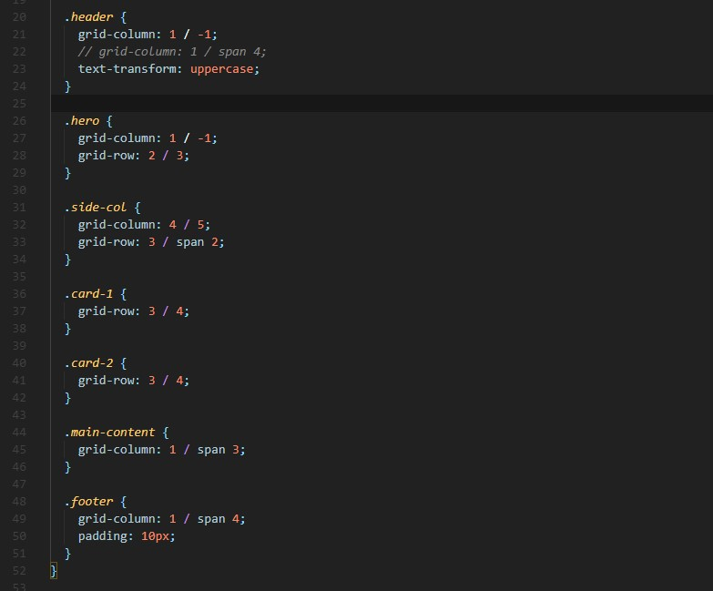
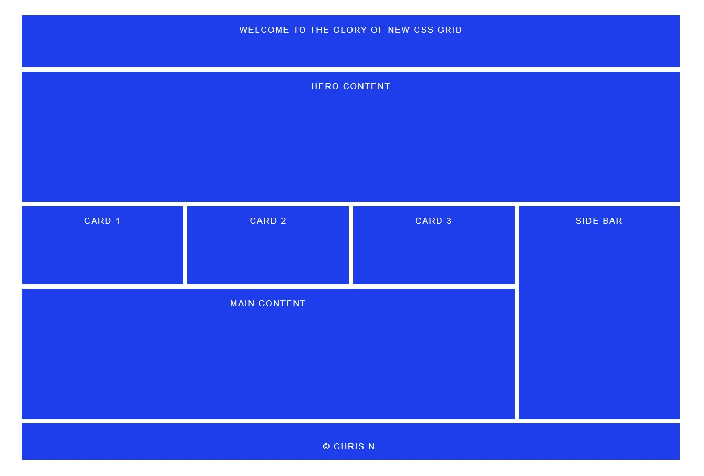

# THE GLORY of NEW CSS GRID SYSTEM
A simple demonstration of the new grid layout from the CSS advance grid system.

## DISCLAIMER STATEMENT
This is the property of Chris N. (I) who have the complete 100% ownership of this wireframe layout and the code that construct the finish layout in HTML and CSS. Chris N. (I) who have the right to use this property and share with any party of interest now and in the future.
The wireframe concept and the code is complete free, and provided as is. 

## PURPOSE of THIS PROJECT
The puspose of this work is to demonstrate and test the CSS grid layout system for experimental, and learning.

## Run test
[Click to run](https://monksedo.github.io/glory-of-newgrid/)

## Code snippet
### Grid system row and columns set

### Grid element postioning

## Screenshot
### WireFrame Design

## Hint on learning how to code 
I took web frontend design and development training, I have completed the course 2 times, meaning I have finished the entire course, coded all of the projects, then take the course again and code all of the projects line by line, then now at the third time on recently, Yes I am rewriting all the code from scratch again. This process helps me because each time I review and recode the projects, I have gained a deep understanding at a much-advanced level of many concepts that I have missed the first time.

This is very common when you are learning anything, the first reading of a book does not give you a full understanding, you only truly gain a deep understanding the second time or the third time, depend on the complexity of the subject that you are learning. That is how to master anything, I did not invent this idea, I had a chance to work for the group surgeons for over 5 years.

This is how doctor become doctor because they are being forced to go over their learning materials, a specialist practice, or a technique thousands of times before they can touch a tool or a patent.
